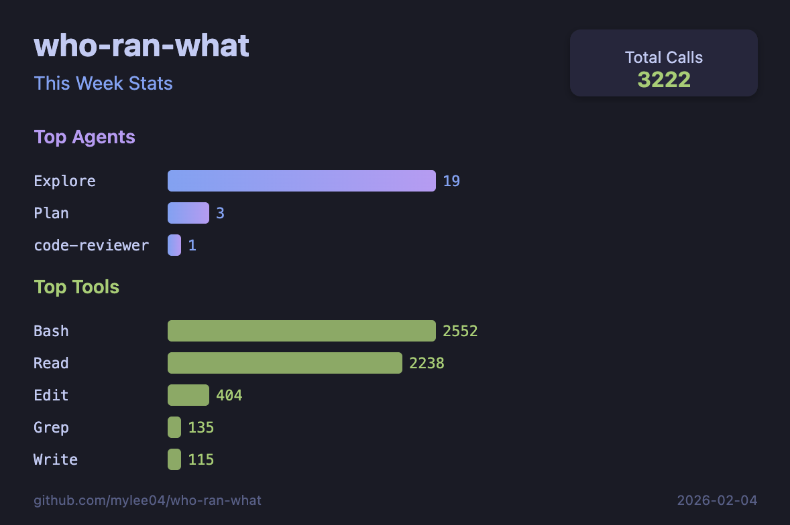
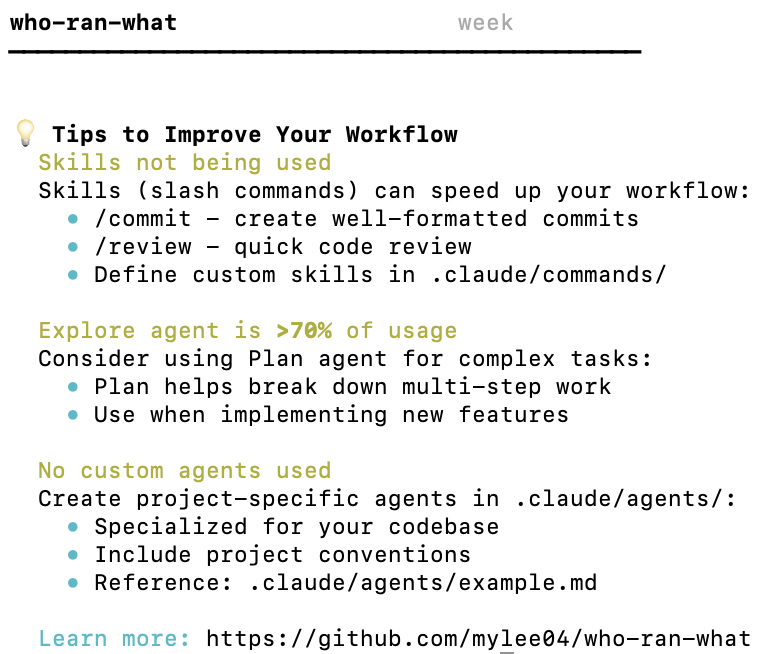

# who-ran-what

> **Track your AI agent and skill usage** - See what ran, when, and how often.

Analytics dashboard for AI coding tools - track agent invocations, skill usage, and optimize your workflow.

[](https://github.com/mylee04/who-ran-what/releases)
[](https://opensource.org/licenses/MIT)
[]()

## Example Output

```
who-ran-what                    week
━━━━━━━━━━━━━━━━━━━━━━━━━━━━━━━━━━━━━━━━━━━━━

📊 Top Agents (This Week)
  ├── Explore      ████████████████████  847 calls
  ├── Plan         ██████████░░░░░░░░░░  412 calls
  ├── code-reviewer ██████░░░░░░░░░░░░░░  298 calls
  └── test-engineer ████░░░░░░░░░░░░░░░░  201 calls

🔧 Top Skills
  ├── commit       ████████████████████  523 uses
  ├── review       ██████████░░░░░░░░░░  287 uses
  └── validate     ██████░░░░░░░░░░░░░░  178 uses

🛠️  Top Tools
  ├── Bash         ████████████████████  3842 uses
  ├── Read         ██████████████████░░  3156 uses
  ├── Edit         ██████░░░░░░░░░░░░░░  892 uses
  ├── Grep         ████░░░░░░░░░░░░░░░░  534 uses
  └── Write        ██░░░░░░░░░░░░░░░░░░  267 uses

📁 Projects with Claude Data
  ├── my-webapp            42 sessions
  ├── api-server           28 sessions
  ├── mobile-app           15 sessions

⚠️  Unused (30+ days)
  └── old-legacy-skill     → Remove?
```

## Features

- **Agent tracking** - See which agents you use most (Explore, Plan, code-reviewer, etc.)
- **Skill analytics** - Track skill/MCP usage frequency
- **Time views** - Daily, weekly, monthly breakdowns
- **Project insights** - Usage patterns per project
- **Cleanup suggestions** - Identify unused agents/skills
- **Share your stats** - Generate beautiful images for social sharing
- **Workflow tips** - Get suggestions to improve your AI coding workflow

## Share Your Stats

Generate a shareable image of your usage stats:

```bash
wr share
```

<p align="center">
  
</p>

## Workflow Tips

Get personalized suggestions to improve your AI coding workflow:

```bash
wr tips
```

<p align="center">
  
</p>

The tips system analyzes your usage patterns and suggests ways to:
- **Diversify agent usage** - Use specialized agents for better results
- **Leverage skills** - Speed up common workflows with slash commands
- **Balance exploration vs planning** - Use Plan for complex multi-step tasks
- **Create custom agents** - Build project-specific agents for your codebase

## Installation

### macOS (Homebrew)

```bash
brew tap mylee04/tools
brew install who-ran-what
```

### macOS / Linux (Manual)

```bash
git clone https://github.com/mylee04/who-ran-what.git
cd who-ran-what
export PATH="$PATH:$(pwd)/bin"
```

### Windows (Git Bash)

```bash
git clone https://github.com/mylee04/who-ran-what.git
cd who-ran-what
echo 'export PATH="$PATH:'$(pwd)'/bin"' >> ~/.bashrc
source ~/.bashrc
```

> For WSL or Cygwin, follow the Linux instructions.

## Quick Start

```bash
wr              # Dashboard (weekly view)
wr today        # Today's usage
wr agents       # Agent breakdown
wr clean        # Find unused items
wrp             # Current project stats
```

## How the Dashboard Works

The default `wr` command shows a **Claude Code-focused dashboard** with a summary of other tools:

```
┌─────────────────────────────────────────────┐
│  who-ran-what                    week       │
│─────────────────────────────────────────────│
│  📊 Top Agents      ← Claude Code agents    │
│  🔧 Top Skills      ← Claude Code skills    │
│  🛠️  Top Tools       ← Claude Code tools     │
│  📁 Projects        ← Claude Code projects  │
│  🔌 Other Tools     ← Gemini/Codex/OpenCode │
│     └── Summary only (total calls)          │
│  📈 Summary         ← Trends & totals       │
│  💡 Tips            ← Workflow suggestions  │
└─────────────────────────────────────────────┘
```

**For detailed stats on each tool, use dedicated commands:**

| Command        | What it shows                          |
| -------------- | -------------------------------------- |
| `wr claude`    | Claude Code agents, tools, skills      |
| `wr gemini`    | Gemini CLI tool usage breakdown        |
| `wr codex`     | Codex CLI tool usage breakdown         |
| `wr opencode`  | OpenCode tool usage breakdown          |

## Usage

| Command       | Description                               |
| ------------- | ----------------------------------------- |
| `wr`          | Dashboard overview (default: weekly view) |
| `wr today`    | Today's usage stats                       |
| `wr week`     | This week's breakdown                     |
| `wr month`    | This month's breakdown                    |
| `wr agents`   | All-time agent statistics                 |
| `wr skills`   | All-time skill statistics                 |
| `wr projects` | Project breakdown                         |
| `wr claude`   | Claude Code tool usage                    |
| `wr gemini`   | Gemini CLI tool usage                     |
| `wr codex`    | Codex CLI tool usage                      |
| `wr opencode` | OpenCode tool usage                       |
| `wr share`    | Generate shareable stats image (SVG)      |
| `wr tips`     | Get tips to improve your workflow         |
| `wr clean`    | Show unused agents/skills (30+ days)      |
| `wrp`         | Current project stats                     |

## Requirements

- **Bash** 3.2 or later
- **jq** (optional, recommended for better parsing)
- **Claude Code** with session data in `~/.claude/`

## Data Sources

| Tool        | Data Location                     | Status          |
| ----------- | --------------------------------- | --------------- |
| Claude Code | `~/.claude/projects/`             | Fully supported |
| Gemini CLI  | `~/.gemini/telemetry.log`         | Supported       |
| Codex CLI   | `~/.codex/sessions/`              | Supported       |
| OpenCode    | `~/.local/share/opencode/storage/`| Supported       |

### Gemini CLI Setup

Gemini CLI requires telemetry to be enabled for tracking. Add to `~/.gemini/settings.json`:

```json
{
  "telemetry": {
    "enabled": true,
    "target": "local",
    "outfile": "~/.gemini/telemetry.log"
  }
}
```

Then use `wr gemini` to view Gemini CLI tool usage.

## Troubleshooting

### "command not found: wr"

```bash
export PATH="$PATH:/path/to/who-ran-what/bin"
```

### "No session data found"

```bash
ls ~/.claude/projects/  # Check if Claude data exists
```

### Install jq (optional)

```bash
# macOS
brew install jq

# Linux
sudo apt install jq
```

## Uninstall

```bash
# Homebrew
brew uninstall who-ran-what

# Manual
rm -rf /path/to/who-ran-what
```

## Contributing

1. Fork the repository
2. Create your feature branch (`git checkout -b feature/amazing-feature`)
3. Commit your changes (`git commit -m 'feat: add amazing feature'`)
4. Push to the branch (`git push origin feature/amazing-feature`)
5. Open a Pull Request

## Links

- [GitHub Repository](https://github.com/mylee04/who-ran-what)
- [Issues & Bug Reports](https://github.com/mylee04/who-ran-what/issues)
- [Releases](https://github.com/mylee04/who-ran-what/releases)

## License

MIT License - see [LICENSE](LICENSE) for details.
